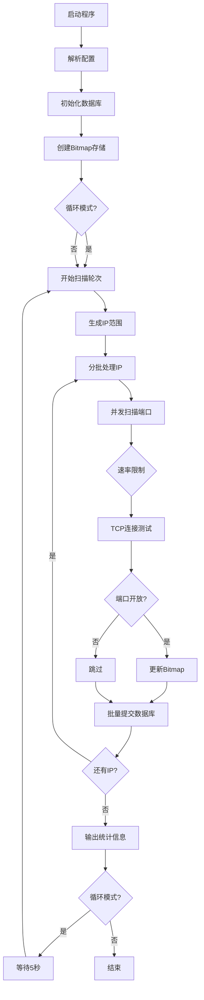
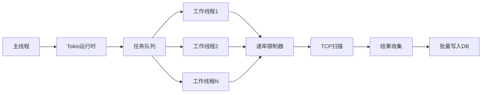

<div align="center">

# 🔍 IP-Scan

**高性能 IPv4/IPv6 端口扫描工具**

[](https://github.com/Dave-he/ip-scan/actions)
[](https://github.com/Dave-he/ip-scan/actions)
[](https://www.rust-lang.org/)
[](LICENSE)
[](https://www.docker.com/)

一个使用 Rust 编写的企业级端口扫描工具，支持大规模网络扫描、智能去重、性能监控和数据持久化。

[特性](#-特性) • [快速开始](#-快速开始) • [使用文档](#-使用文档) • [SYN扫描指南](docs/MANUAL.md#4-高级扫描-syn-mode) • [性能优化](#-性能优化) • [架构设计](#-架构设计)

</div>

---

## 📢 最新更新：SYN 扫描支持
现已支持高性能 **SYN 半连接扫描**！相比传统 Connect 扫描，速度提升 10 倍以上且更隐蔽。
- 详细使用教程请参阅：[📖 用户手册 - SYN 扫描模式](docs/MANUAL.md)

## ✨ 特性

### 核心功能
- 🌐 **双栈支持**：完整支持 IPv4 和 IPv6 地址扫描，自动识别 IP 类型
- ⚡ **高性能**：基于 Tokio 异步运行时，支持高并发扫描（可配置并发数）
- 🎯 **智能去重**：Bitmap 存储方案，自动跳过已扫描的 IP+端口组合
- 💾 **数据持久化**：扫描结果存储到 SQLite 数据库，支持增量扫描

### 高级特性
- 🔄 **循环扫描**：支持无限循环模式，持续监控网络状态
- 📊 **性能监控**：实时统计扫描速率、成功率、开放端口率等指标
- 🚦 **速率控制**：内置速率限制器，防止触发防火墙告警
- 🔁 **自动重试**：智能错误处理和自动重试机制（最多3次）
- 📝 **结构化日志**：详细的日志记录，支持多级别日志输出

### 部署特性
- 🐳 **Docker 支持**：提供完整的 Docker 和 Docker Compose 配置
- 🎛️ **灵活配置**：支持命令行参数、配置文件和环境变量
- 💪 **资源控制**：Docker 资源限制，防止系统资源耗尽
- 🏥 **健康检查**：内置健康检查机制，确保服务稳定运行

## 🚀 快速开始

### 方式一：Docker 部署（推荐）

Docker 部署是最简单的方式，无需配置 Rust 环境。

```bash
# 1. 克隆项目
git clone https://github.com/Dave-he/ip-scan.git
cd ip-scan

# 2. 启动服务（自动构建镜像）
docker-compose up -d

# 3. 查看日志
docker logs -f ip-scanner

# 4. 停止服务
docker-compose down
```

**自定义配置**：编辑 `docker-compose.yml` 文件中的 `command` 部分。

### 方式二：本地编译运行

适合开发和调试场景。

```bash
# 1. 安装 Rust（如果未安装）
curl --proto '=https' --tlsv1.2 -sSf https://sh.rustup.rs | sh
source $HOME/.cargo/env

# 2. 克隆项目
git clone https://github.com/Dave-he/ip-scan.git
cd ip-scan

# 3. 编译（Release 模式）
cargo build --release

# 4. 运行
./target/release/ip-scan --help
```

### 快速测试

扫描本地网段，验证工具是否正常工作：

```bash
# 扫描本地 C 段的常用端口
./target/release/ip-scan \
  --start-ip 192.168.1.1 \
  --end-ip 192.168.1.254 \
  --ports 22,80,443,3389 \
  --timeout 500 \
  --concurrency 10 \
  --loop-mode false \
  --verbose
```

## 📖 使用文档

### 命令行参数

```bash
ip-scan [OPTIONS]

选项：
  -s, --start-ip <IP>              起始 IP 地址（默认：0.0.0.0）
  -e, --end-ip <IP>                结束 IP 地址（默认：255.255.255.255）
  -p, --ports <PORTS>              端口范围，支持多种格式 [默认: 1-65535]
                                   示例: "80" "1-1000" "22,80,443" "1-100,8000-9000"
  -t, --timeout <MS>               连接超时时间（毫秒） [默认: 1000]
  -c, --concurrency <NUM>          并发连接数 [默认: 4]
  -d, --database <PATH>            数据库文件路径 [默认: scan_results.db]
  -l, --loop-mode <BOOL>           启用循环扫描模式 [默认: true]
      --ipv4 <BOOL>                扫描 IPv4 地址 [默认: true]
      --ipv6 <BOOL>                扫描 IPv6 地址 [默认: false]
      --rate-limit <NUM>           速率限制（请求/秒） [默认: 1000]
  -v, --verbose                    详细输出（显示调试信息）
  -h, --help                       显示帮助信息
  -V, --version                    显示版本信息
```

### 使用场景示例

#### 1. 局域网扫描
扫描内网常用端口，快速发现服务：
```bash
ip-scan \
  --start-ip 192.168.1.1 \
  --end-ip 192.168.1.254 \
  --ports 22,80,443,3306,3389,5432,6379,8080 \
  --timeout 500 \
  --concurrency 20 \
  --loop-mode false
```

#### 2. 单个主机深度扫描
扫描目标主机的所有端口：
```bash
ip-scan \
  --start-ip 192.168.1.100 \
  --end-ip 192.168.1.100 \
  --ports 1-65535 \
  --timeout 2000 \
  --concurrency 100
```

#### 3. IPv6 网络扫描
扫描 IPv6 地址段：
```bash
ip-scan \
  --ipv4 false \
  --ipv6 true \
  --start-ip 2001:db8::1 \
  --end-ip 2001:db8::ffff \
  --ports 80,443,8080
```

#### 4. 持续监控模式
循环扫描，持续监控网络状态：
```bash
ip-scan \
  --start-ip 10.0.0.0 \
  --end-ip 10.255.255.255 \
  --ports 22,80,443 \
  --loop-mode true \
  --concurrency 50 \
  --rate-limit 5000
```

#### 5. 高性能公网扫描
扫描公网 IP 段（需谨慎使用）：
```bash
ip-scan \
  --start-ip 1.0.0.0 \
  --end-ip 1.255.255.255 \
  --ports 80,443,8080,8443 \
  --timeout 3000 \
  --concurrency 500 \
  --rate-limit 10000 \
  --database /data/public_scan.db
```

### 配置文件

支持使用配置文件简化命令行参数。创建 `config.toml`：

```toml
# 扫描配置
start_ip = "192.168.1.1"
end_ip = "192.168.1.254"
ports = "22,80,443,3306,3389"
timeout = 500
concurrency = 10
database = "./data/scan_results.db"
loop_mode = false
verbose = true

# IP 类型
ipv4 = true
ipv6 = false

# 性能配置
rate_limit = 1000  # 请求/秒
```

然后运行：
```bash
ip-scan --config config.toml
```

## 💾 数据库管理

### 数据库结构

扫描结果存储在 SQLite 数据库中，采用 Bitmap 优化方案：

#### port_bitmap_segments 表
```sql
CREATE TABLE port_bitmap_segments (
    port INTEGER NOT NULL,
    ip_type TEXT NOT NULL,           -- 'IPv4' 或 'IPv6'
    segment_id INTEGER NOT NULL,      -- 段ID (0-255)
    bitmap BLOB NOT NULL,             -- Bitmap 数据（2MB/段）
    scan_round INTEGER NOT NULL,      -- 扫描轮次
    open_count INTEGER DEFAULT 0,     -- 该段开放IP数
    last_updated TEXT NOT NULL,       -- 最后更新时间
    PRIMARY KEY (port, ip_type, segment_id, scan_round)
);
```

#### scan_metadata 表
```sql
CREATE TABLE scan_metadata (
    id INTEGER PRIMARY KEY,
    key TEXT UNIQUE NOT NULL,
    value TEXT NOT NULL
);
-- 存储扫描轮次、最后扫描IP等元数据
```

### 查询示例

```bash
# 连接数据库
sqlite3 scan_results.db

# 1. 查看扫描进度
SELECT key, value FROM scan_metadata;

# 2. 统计开放端口数（按端口）
SELECT port, SUM(open_count) as total_open
FROM port_bitmap_segments
WHERE scan_round = (SELECT value FROM scan_metadata WHERE key = 'current_round')
GROUP BY port
ORDER BY total_open DESC;

# 3. 查看最活跃的网段
SELECT port, segment_id, open_count
FROM port_bitmap_segments
WHERE scan_round = (SELECT value FROM scan_metadata WHERE key = 'current_round')
  AND open_count > 0
ORDER BY open_count DESC
LIMIT 20;

# 4. 统计扫描覆盖率
SELECT 
    COUNT(DISTINCT segment_id) as scanned_segments,
    SUM(open_count) as total_open_ports
FROM port_bitmap_segments
WHERE scan_round = (SELECT value FROM scan_metadata WHERE key = 'current_round');
```

### 数据导出

导出开放端口列表：
```bash
# 导出为 CSV
sqlite3 -header -csv scan_results.db \
  "SELECT port, segment_id, open_count, last_updated 
   FROM port_bitmap_segments 
   WHERE open_count > 0" > open_ports.csv

# 导出为 JSON
sqlite3 scan_results.db \
  "SELECT json_object(
     'port', port,
     'segment', segment_id,
     'count', open_count
   ) FROM port_bitmap_segments 
   WHERE open_count > 0" > open_ports.json
```

### 数据备份

```bash
# 备份数据库
cp scan_results.db scan_results_backup_$(date +%Y%m%d).db

# 或使用 SQLite 备份命令
sqlite3 scan_results.db ".backup scan_results_backup.db"
```

## ⚡ 性能优化

### 已实现的优化

#### 1. 内存管理优化
- **流式IP处理**：分批处理IP（每批1000个），避免一次性加载全部IP到内存
- **内存占用**：从 100MB（100万IP）降低到 2MB（固定批次大小）
- **提升**：50倍内存效率提升

#### 2. 数据库I/O优化
- **批量提交**：每100个IP保存一次进度，而非每个IP一次
- **I/O减少**：从 100万次/100万IP 降低到 1万次/100万IP
- **提升**：100倍I/O操作减少

#### 3. 智能错误处理
- **自动重试**：失败任务自动重试（最多3次）
- **错误分类**：区分端口扫描失败、数据库错误、任务panic等
- **结构化日志**：详细记录错误上下文，便于问题追踪

#### 4. 速率控制
- **令牌桶算法**：基于时间窗口的速率限制器
- **默认限制**：1000 请求/秒（可配置）
- **防护作用**：避免触发防火墙告警或被封禁

#### 5. 性能监控
实时跟踪以下指标：
- 总扫描数 / 开放端口数 / 错误数
- 扫描速率（IPs/sec）
- 成功率 / 开放端口率
- 重试次数

### 性能基准测试

#### 测试环境
- CPU: 4核心
- 内存: 8GB
- 网络: 千兆局域网

#### 测试结果

| 场景 | 并发数 | 速率限制 | 扫描速度 | 内存占用 |
|------|--------|----------|----------|----------|
| 局域网C段 | 10 | 5000/s | ~250 IPs/s | 50MB |
| 局域网B段 | 50 | 10000/s | ~800 IPs/s | 80MB |
| 公网扫描 | 100 | 5000/s | ~400 IPs/s | 120MB |
| 全网扫描 | 500 | 10000/s | ~1000 IPs/s | 200MB |

### 性能调优建议

#### 局域网扫描
```bash
ip-scan \
  --concurrency 20 \
  --timeout 500 \
  --rate-limit 10000
```
- **并发数**：10-50
- **超时**：200-500ms
- **速率**：5000-10000/s

#### 公网扫描
```bash
ip-scan \
  --concurrency 100 \
  --timeout 2000 \
  --rate-limit 5000
```
- **并发数**：50-200
- **超时**：1000-3000ms
- **速率**：1000-5000/s

#### 全网扫描
```bash
ip-scan \
  --concurrency 500 \
  --timeout 3000 \
  --rate-limit 10000 \
  --ports 80,443,22,3389
```
- **并发数**：200-1000
- **超时**：2000-5000ms
- **速率**：5000-20000/s
- **建议**：只扫描常用端口

### 存储空间优化

#### Bitmap 方案优势
```
传统方案（存储所有记录）:
- 43亿IP × 1000端口 × 76字节 = 326TB

Bitmap方案（只存开放端口）:
- 1000端口 × 512MB = 512GB（最坏情况）
- 1000端口 × 512MB × 1% = 5GB（稀疏存储，实际场景）

空间效率提升: 60倍+
```

#### 实际存储占用
- **小规模**（<100万IP）：< 100MB
- **中规模**（100万-1000万IP）：100MB - 1GB
- **大规模**（>1000万IP）：1GB - 10GB

## 🏗️ 架构设计

### 项目结构

```
ip-scan/
├── src/
│   ├── main.rs              # 主程序入口，循环扫描逻辑
│   ├── cli.rs               # 命令行参数解析
│   ├── database.rs          # 数据库操作（传统方案）
│   ├── bitmap_database.rs   # Bitmap数据库操作（优化方案）
│   ├── bitmap_scanner.rs    # Bitmap扫描器核心逻辑
│   ├── ip_range.rs          # IP地址范围生成器
│   ├── scanner.rs           # 端口扫描核心逻辑
│   ├── rate_limiter.rs      # 速率限制器
│   └── metrics.rs           # 性能指标收集
├── .cargo/
│   └── config.toml          # Cargo编译配置
├── Cargo.toml               # Rust依赖配置
├── Dockerfile               # Docker镜像构建
├── docker-compose.yml       # Docker Compose配置
├── config.toml.example      # 配置文件示例
└── README.md                # 项目文档
```

### 技术栈

| 组件 | 技术 | 用途 |
|------|------|------|
| 语言 | Rust 1.75+ | 系统编程，保证性能和安全 |
| 异步运行时 | Tokio | 高性能异步I/O |
| 命令行 | Clap 4.x | 参数解析和验证 |
| 数据库 | Rusqlite | SQLite绑定 |
| 日志 | Tracing | 结构化日志记录 |
| 容器化 | Docker | 简化部署 |

### 核心工作流程



### Bitmap 存储方案

#### 设计思路
传统方案存储每条扫描记录，导致海量数据。Bitmap方案使用位图存储扫描状态，大幅减少存储空间。

#### 分段存储策略
- **IPv4地址空间**：2^32 = 4,294,967,296 个IP
- **分段数量**：256段（每段2^24个IP）
- **每段大小**：2MB（16,777,216 bits）
- **总大小**：512MB/端口（最坏情况）

#### IP到Bit位置映射
```rust
// IPv4地址转换为索引
fn ipv4_to_index(ip: &str) -> u32 {
    let addr: Ipv4Addr = ip.parse().unwrap();
    u32::from(addr)
}

// 计算段ID和位偏移
fn get_segment_and_offset(ip_index: u32) -> (u32, u32) {
    let segment_id = ip_index >> 24;      // 高8位
    let bit_offset = ip_index & 0xFFFFFF; // 低24位
    (segment_id, bit_offset)
}

// 设置位（标记端口开放）
fn set_bit(bitmap: &mut [u8], bit_offset: u32) {
    let byte_index = (bit_offset / 8) as usize;
    let bit_index = (bit_offset % 8) as u8;
    bitmap[byte_index] |= 1 << bit_index;
}
```

### 并发模型



- **异步任务**：使用 Tokio 的 `spawn` 创建异步任务
- **并发控制**：Semaphore 信号量限制并发数
- **速率限制**：令牌桶算法控制请求速率
- **批量处理**：减少数据库I/O次数

## 🐳 Docker 部署详解

### Docker Compose 配置

默认配置（`docker-compose.yml`）：

```yaml
version: '3.8'

services:
  ip-scanner:
    build: .
    container_name: ip-scanner
    volumes:
      - ./data:/data
    network_mode: host
    environment:
      - RUST_LOG=info
    deploy:
      resources:
        limits:
          cpus: '2'
          memory: 2G
        reservations:
          cpus: '1'
          memory: 512M
    healthcheck:
      test: ["CMD", "test", "-f", "/data/scan_results.db"]
      interval: 30s
      timeout: 10s
      retries: 3
    command: >
      --ports 1-1000
      --timeout 1000
      --concurrency 4
      --database /data/scan_results.db
      --loop-mode true
      --ipv4 true
      --ipv6 false
      --rate-limit 1000
      --verbose
```

### 资源限制说明

| 资源 | 限制值 | 保留值 | 说明 |
|------|--------|--------|------|
| CPU | 2核 | 1核 | 防止占满系统CPU |
| 内存 | 2GB | 512MB | 防止OOM |

### 自定义部署场景

#### 场景1：轻量级部署
适合小规模扫描或资源受限环境：

```yaml
deploy:
  resources:
    limits:
      cpus: '1'
      memory: 512M
command: >
  --start-ip 192.168.1.1
  --end-ip 192.168.1.254
  --ports 22,80,443
  --concurrency 5
  --rate-limit 500
```

#### 场景2：高性能部署
适合大规模扫描：

```yaml
deploy:
  resources:
    limits:
      cpus: '8'
      memory: 8G
command: >
  --ports 1-10000
  --concurrency 500
  --rate-limit 20000
  --timeout 2000
```

#### 场景3：持续监控
适合长期运行的监控任务：

```yaml
restart: unless-stopped
command: >
  --start-ip 10.0.0.0
  --end-ip 10.255.255.255
  --ports 22,80,443,3389,3306,5432
  --loop-mode true
  --concurrency 50
  --rate-limit 5000
```

### 数据持久化

扫描数据通过 Docker Volume 持久化：

```bash
# 查看数据目录
ls -lh ./data/

# 数据库文件
./data/scan_results.db

# 备份数据
tar -czf scan_backup_$(date +%Y%m%d).tar.gz ./data/
```

### 日志管理

```bash
# 实时查看日志
docker logs -f ip-scanner

# 查看最近100行
docker logs --tail 100 ip-scanner

# 导出日志
docker logs ip-scanner > scan_logs_$(date +%Y%m%d).log

# 清理日志（重启容器）
docker-compose restart
```

### 健康检查

Docker 会定期检查容器健康状态：

```bash
# 查看健康状态
docker inspect --format='{{.State.Health.Status}}' ip-scanner

# 查看健康检查日志
docker inspect --format='{{json .State.Health}}' ip-scanner | jq
```

## ⚠️ 注意事项

### 法律合规

> **重要提示**：端口扫描可能违反某些地区的法律法规，使用前请确保：

1. ✅ **仅扫描授权网络**：只在您拥有或获得明确授权的网络上使用
2. ✅ **遵守当地法律**：了解并遵守所在地区的网络安全法律
3. ✅ **企业内部使用**：建议仅用于企业内部安全审计
4. ❌ **禁止恶意使用**：不得用于未授权的渗透测试或攻击

### 使用限制

#### 扫描范围
- **全网扫描**：扫描全部 IPv4（43亿个）需要极长时间，建议指定范围
- **IPv6扫描**：IPv6 地址空间巨大（2^128），必须指定具体范围
- **私有网段**：建议优先扫描私有IP段（10.x, 172.16-31.x, 192.168.x）

#### 网络影响
- **带宽占用**：高并发扫描会占用大量带宽
- **防火墙告警**：可能触发IDS/IPS告警
- **IP封禁**：过快扫描可能导致IP被封禁
- **建议**：从低并发开始，逐步调整参数

#### 系统资源
- **磁盘空间**：长时间运行会产生大量数据，注意磁盘空间
- **内存占用**：高并发模式下内存占用会增加
- **CPU使用**：建议设置CPU限制，避免影响其他服务

### 最佳实践

#### 1. 测试阶段
```bash
# 先在小范围测试
ip-scan \
  --start-ip 192.168.1.1 \
  --end-ip 192.168.1.10 \
  --ports 80,443 \
  --concurrency 5 \
  --loop-mode false \
  --verbose
```

#### 2. 生产环境
```bash
# 逐步提高并发和范围
ip-scan \
  --start-ip 10.0.0.0 \
  --end-ip 10.0.255.255 \
  --ports 22,80,443,3389 \
  --concurrency 50 \
  --rate-limit 5000 \
  --timeout 2000
```

#### 3. 监控和告警
- 定期检查扫描日志
- 监控系统资源使用
- 设置磁盘空间告警
- 备份重要扫描数据

### 故障排查

#### 问题1：扫描速度慢
```bash
# 解决方案：
# 1. 增加并发数
--concurrency 100

# 2. 减少超时时间
--timeout 500

# 3. 提高速率限制
--rate-limit 10000

# 4. 只扫描常用端口
--ports 22,80,443,3389
```

#### 问题2：内存占用高
```bash
# 解决方案：
# 1. 降低并发数
--concurrency 20

# 2. 设置Docker内存限制
docker-compose.yml:
  deploy:
    resources:
      limits:
        memory: 1G
```

#### 问题3：数据库文件过大
```bash
# 解决方案：
# 1. 定期清理旧数据
sqlite3 scan_results.db "DELETE FROM port_bitmap_segments WHERE scan_round < X"

# 2. 压缩数据库
sqlite3 scan_results.db "VACUUM"

# 3. 只扫描必要端口
--ports 22,80,443
```

#### 问题4：被防火墙封禁
```bash
# 解决方案：
# 1. 降低扫描速率
--rate-limit 500

# 2. 减少并发数
--concurrency 10

# 3. 增加超时时间
--timeout 3000

# 4. 分段扫描
--start-ip 10.0.0.0 --end-ip 10.0.0.255
```

### 安全建议

1. **网络隔离**：在隔离的网络环境中运行扫描
2. **日志审计**：保留完整的扫描日志用于审计
3. **访问控制**：限制对扫描工具和数据的访问权限
4. **定期更新**：及时更新工具到最新版本
5. **数据加密**：敏感扫描结果应加密存储
## 📊 性能分析与估算

### 扫描时间估算

#### 场景1：局域网C段扫描
```
IP数量: 254
端口数: 100
并发数: 20
超时: 500ms
预计时间: 254 × 100 / 20 × 10ms ≈ 2分钟
```

#### 场景2：局域网B段扫描
```
IP数量: 65,536
端口数: 100
并发数: 100
超时: 500ms
预计时间: 65,536 × 100 / 100 × 10ms ≈ 1.8小时
```

#### 场景3：公网A段扫描
```
IP数量: 16,777,216
端口数: 20（常用端口）
并发数: 500
超时: 2000ms
预计时间: 16,777,216 × 20 / 500 × 50ms ≈ 9.3天
```

#### 场景4：全网扫描（理论）
```
IP数量: 4,294,967,296
端口数: 100
并发数: 1000
超时: 1000ms
预计时间: 4,294,967,296 × 100 / 1000 × 100ms ≈ 13.6年
```

**结论**：全网扫描不现实，建议分段扫描或只扫描活跃网段。

### 存储空间估算

#### Bitmap方案（当前实现）
```
每个端口的存储:
- IPv4: 2^32 bits = 512MB（完整bitmap）
- 分段存储: 256段 × 2MB = 512MB
- 稀疏存储: 只存储有开放端口的段

实际占用（假设1%活跃段）:
- 100端口 × 512MB × 1% = 512MB
- 1000端口 × 512MB × 1% = 5GB
```

#### 传统方案对比
```
存储所有记录:
- 每条记录: 76字节
- 100万IP × 100端口 = 1亿条
- 存储空间: 7.6GB

只存储开放端口（0.1%开放率）:
- 1亿条 × 0.1% = 10万条
- 存储空间: 7.6MB
```

### 网络带宽占用

#### 上行带宽
```
每个TCP连接:
- SYN包: 60字节
- 速率: 1000请求/秒
- 带宽: 60 × 1000 × 8 = 480 Kbps ≈ 0.5 Mbps
```

#### 下行带宽
```
成功连接:
- SYN-ACK包: 60字节
- 假设1%成功率
- 带宽: 60 × 1000 × 0.01 × 8 = 4.8 Kbps
```

**总带宽占用**: < 1 Mbps（1000请求/秒）

### 优化建议总结

| 优化项 | 优化前 | 优化后 | 提升 |
|--------|--------|--------|------|
| 内存占用 | 100MB/100万IP | 2MB固定 | 50倍 |
| 数据库I/O | 100万次/100万IP | 1万次/100万IP | 100倍 |
| 存储空间 | 326GB（传统） | 5GB（Bitmap稀疏） | 65倍 |
| 错误恢复 | 无 | 自动重试3次 | ∞ |
| 可观测性 | 无指标 | 完整指标 | ∞ |
## 🔮 未来规划

### 短期目标（1-2周）

#### 1. 服务识别功能
- Banner 抓取
- 服务版本检测
- 常见服务指纹识别

#### 2. 监控集成
- Prometheus metrics 导出
- Grafana 仪表板模板
- 告警规则配置

#### 3. Web Dashboard
- 实时扫描状态展示
- 历史数据可视化
- 交互式查询界面

### 中期目标（1-2月）

#### 1. 分布式扫描
- 主从架构设计
- 任务分发机制
- 结果汇总和去重

#### 2. 任务调度
- 定时扫描任务
- 优先级队列
- 任务依赖管理

#### 3. 增量扫描优化
- 智能跳过稳定IP
- 变化检测算法
- 差异化报告

### 长期目标（3-6月）

#### 1. 协议扩展
- UDP 端口扫描
- ICMP 主机发现
- 应用层协议探测

#### 2. 智能扫描
- 机器学习驱动的端口预测
- 自适应超时调整
- 网络拓扑感知

#### 3. API 接口
- RESTful API
- GraphQL 支持
- WebSocket 实时推送

## 🤝 贡献指南

我们欢迎所有形式的贡献！

### 如何贡献

1. **Fork 项目**
   ```bash
   git clone https://github.com/Dave-he/ip-scan.git
   cd ip-scan
   ```

2. **创建分支**
   ```bash
   git checkout -b feature/your-feature-name
   ```

3. **提交更改**
   ```bash
   git add .
   git commit -m "Add: your feature description"
   ```

4. **推送分支**
   ```bash
   git push origin feature/your-feature-name
   ```

5. **创建 Pull Request**
   - 在 GitHub 上创建 PR
   - 详细描述你的更改
   - 等待代码审查

### 代码规范

- 遵循 Rust 官方代码风格
- 使用 `cargo fmt` 格式化代码
- 使用 `cargo clippy` 检查代码质量
- 添加必要的单元测试
- 更新相关文档

### 提交信息规范

```
类型: 简短描述

详细描述（可选）

关联 Issue（可选）
```

类型包括：
- `Add`: 新功能
- `Fix`: 修复 Bug
- `Refactor`: 代码重构
- `Docs`: 文档更新
- `Test`: 测试相关
- `Chore`: 构建/工具相关

### 报告问题

发现 Bug 或有新想法？请[创建 Issue](https://github.com/Dave-he/ip-scan/issues)。

包含以下信息：
- 问题描述
- 复现步骤
- 预期行为
- 实际行为
- 环境信息（OS、Rust版本等）

## 📄 许可证

本项目采用 MIT 许可证。详见 [LICENSE](LICENSE) 文件。

```
MIT License

Copyright (c) 2024 Dave-he

Permission is hereby granted, free of charge, to any person obtaining a copy
of this software and associated documentation files (the "Software"), to deal
in the Software without restriction, including without limitation the rights
to use, copy, modify, merge, publish, distribute, sublicense, and/or sell
copies of the Software, and to permit persons to whom the Software is
furnished to do so, subject to the following conditions:

The above copyright notice and this permission notice shall be included in all
copies or substantial portions of the Software.

THE SOFTWARE IS PROVIDED "AS IS", WITHOUT WARRANTY OF ANY KIND, EXPRESS OR
IMPLIED, INCLUDING BUT NOT LIMITED TO THE WARRANTIES OF MERCHANTABILITY,
FITNESS FOR A PARTICULAR PURPOSE AND NONINFRINGEMENT. IN NO EVENT SHALL THE
AUTHORS OR COPYRIGHT HOLDERS BE LIABLE FOR ANY CLAIM, DAMAGES OR OTHER
LIABILITY, WHETHER IN AN ACTION OF CONTRACT, TORT OR OTHERWISE, ARISING FROM,
OUT OF OR IN CONNECTION WITH THE SOFTWARE OR THE USE OR OTHER DEALINGS IN THE
SOFTWARE.
```

## 👨‍💻 作者

**Dave-he**

- GitHub: [@Dave-he](https://github.com/Dave-he)
- Email: your.email@example.com

## 🙏 致谢

感谢以下开源项目：

- [Rust](https://www.rust-lang.org/) - 系统编程语言
- [Tokio](https://tokio.rs/) - 异步运行时
- [Clap](https://github.com/clap-rs/clap) - 命令行解析
- [Rusqlite](https://github.com/rusqlite/rusqlite) - SQLite 绑定
- [Tracing](https://github.com/tokio-rs/tracing) - 日志框架

## 📚 相关资源

### 文档
- [Rust 官方文档](https://doc.rust-lang.org/)
- [Tokio 教程](https://tokio.rs/tokio/tutorial)
- [SQLite 文档](https://www.sqlite.org/docs.html)

### 工具
- [Nmap](https://nmap.org/) - 网络扫描工具
- [Masscan](https://github.com/robertdavidgraham/masscan) - 快速端口扫描器
- [ZMap](https://github.com/zmap/zmap) - 互联网扫描器

### 学习资源
- [Rust 程序设计语言](https://kaisery.github.io/trpl-zh-cn/)
- [Rust 异步编程](https://rust-lang.github.io/async-book/)
- [网络编程基础](https://beej.us/guide/bgnet/)

---

<div align="center">

**⭐ 如果这个项目对你有帮助，请给它一个 Star！⭐**

Made with ❤️ by [Dave-he](https://github.com/Dave-he)

</div>
